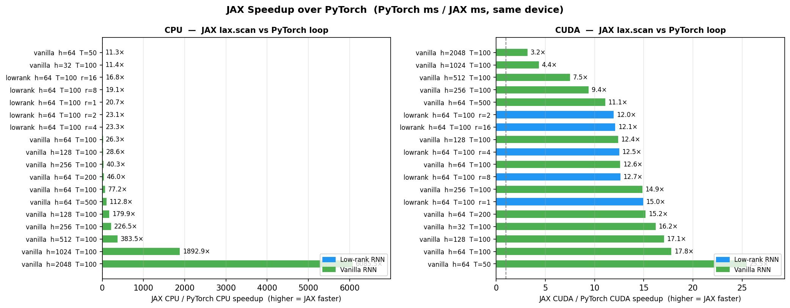
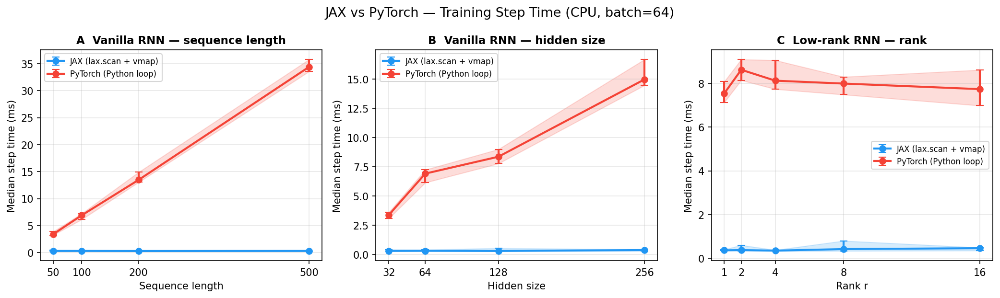
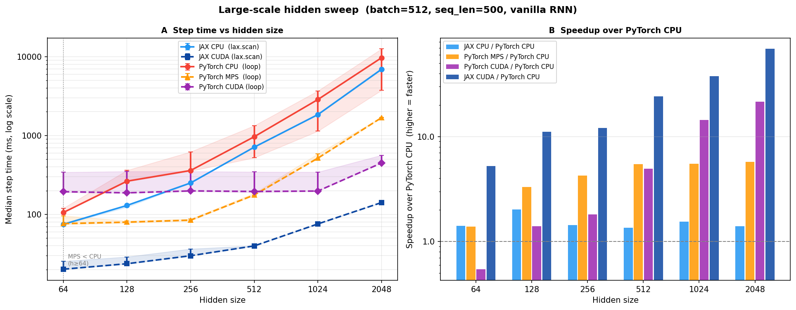

# JAX/Flax RNN Tutorial

A hands-on tutorial for ML practitioners who know PyTorch and want to learn JAX and Flax. Covers JAX fundamentals, efficient sequence modeling with `lax.scan` and `vmap`, ODE solvers, and training Vanilla and Low-rank RNNs — with PyTorch numerical-consistency checks and wall-clock benchmarks throughout.

## What You'll Learn

| Notebook | Topic | Colab |
|---|---|---|
| `01_jax_basics` | `jnp`, `jit`, `grad`, tracing model | [](https://colab.research.google.com/github/NeoNeuron/jax_tutorial/blob/main/notebooks/01_jax_basics.ipynb) |
| `02_vmap_and_scan` | Batching with `vmap`, efficient loops with `lax.scan` | [](https://colab.research.google.com/github/NeoNeuron/jax_tutorial/blob/main/notebooks/02_vmap_and_scan.ipynb) |
| `03_ode_solving` | Euler/RK4 solvers, vmap over initial conditions | [](https://colab.research.google.com/github/NeoNeuron/jax_tutorial/blob/main/notebooks/03_ode_solving.ipynb) |
| `04_vanilla_rnn` | Vanilla RNN cell in Flax NNX, trained with Optax | [](https://colab.research.google.com/github/NeoNeuron/jax_tutorial/blob/main/notebooks/04_vanilla_rnn.ipynb) |
| `05_lowrank_rnn` | Low-rank RNN (`W = MN^T`, rank-r constraint by construction) | [](https://colab.research.google.com/github/NeoNeuron/jax_tutorial/blob/main/notebooks/05_lowrank_rnn.ipynb) |
| `06_training_pipeline` | Train loop, checkpointing with Orbax | [](https://colab.research.google.com/github/NeoNeuron/jax_tutorial/blob/main/notebooks/06_training_pipeline.ipynb) |
| `07_pytorch_comparison` | Load identical weights → assert `max|JAX − PyTorch| < 1e-5` | [](https://colab.research.google.com/github/NeoNeuron/jax_tutorial/blob/main/notebooks/07_pytorch_comparison.ipynb) |
| `08_benchmarks` | Timing sweeps, plots from `benchmarks/run_benchmarks.py` | [](https://colab.research.google.com/github/NeoNeuron/jax_tutorial/blob/main/notebooks/08_benchmarks.ipynb) |

## Quick Start

```bash
pip install -r requirements.txt
python -c "import jax, flax, torch; print('OK')"

# Run a quick benchmark
python benchmarks/run_benchmarks.py --framework both --model vanilla --hidden 64 --seq-len 100 --batch 64

# Execute a notebook headlessly
jupyter nbconvert --to notebook --execute notebooks/01_jax_basics.ipynb
```

For GPU JAX:
```bash
pip install "jax[cuda12]" -f https://storage.googleapis.com/jax-releases/jax_cuda_releases.html
```

## Benchmark Highlights

**Key finding**: JAX's `lax.scan` compiles the entire T-step RNN loop into a single XLA kernel dispatch, while PyTorch dispatches T separate CUDA kernels — one per time step. At `seq_len=500`, this means 500 kernel launches × ~10 µs overhead = ~5 ms of overhead before any compute, making JAX dramatically faster on GPU for sequential models.

**CPU speedup (JAX vs PyTorch, `lax.scan` vs Python loop):**



JAX is **5–12× faster** on CPU across all sweep configurations. On CPU, PyTorch's loop overhead dominates because JAX compiles the whole scan whereas PyTorch re-dispatches per step.

**Sweep: step time vs. sequence length and hidden size (batch=64):**



**Large-scale sweep (batch=512, hidden up to 2048):**



At large hidden size, GPU compute dominates and both frameworks scale similarly — but JAX retains its advantage through better kernel fusion.

## Repository Layout

```
notebooks/          # 8 Jupyter notebooks
src/
  rnn_jax.py        # VanillaRNN + LowRankRNN in Flax NNX
  rnn_torch.py      # Equivalent PyTorch modules
  ode_solvers.py    # RK4 solver using lax.scan
  train.py          # train_step, eval_step, fit loop
  utils.py          # data generation, weight conversion, plotting
benchmarks/
  run_benchmarks.py # CLI: sweep configs, write JSON to results/
  figures/          # PNG/PDF plots
tests/
  test_models.py    # Shape checks, scan-vs-loop equivalence
  test_consistency.py  # JAX vs PyTorch output/gradient matching
```

## Running Tests

```bash
pytest tests/ -v
pytest tests/test_consistency.py -v -s   # prints max output/grad diff
```
